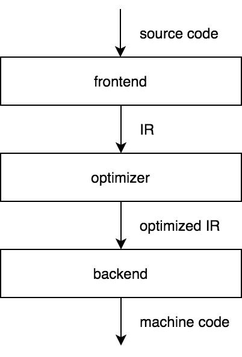

# Pythonista

- **Python behind the scenes #1: How CPython VM  works**
    
    CPython is the reference implementation of the Python programming language. It's the most widely used and the one that many developers are most familiar with. The CPython Virtual Machine (VM) is responsible for executing Python code. Here's a high-level overview of how CPython works:
    
    1. **Source Code**: Python programs are written in plain text and saved with a `.py` extension. These Python source files contain your code.
    2. **Parsing**: When you run a Python script, the CPython interpreter first reads and parses the source code. During this process, the code is checked for syntax errors and converted into a data structure called the Abstract Syntax Tree (AST).
    3. **Bytecode Compilation**: The AST is then compiled into a lower-level representation called bytecode. Bytecode is a set of instructions that the CPython VM can execute. This bytecode is stored in `.pyc` files for future use, to avoid recompilation each time you run the script.
    4. **Execution**: The CPython VM is responsible for executing the bytecode. It consists of several components, including:
        - **Interpreter**: The core component that reads and executes bytecode instructions one by one. It also manages the Python runtime environment.
        - **Memory Management**: CPython manages memory, including objects, using reference counting and a garbage collector.
        - **Global Interpreter Lock (GIL)**: CPython has a GIL that allows only one thread to execute Python code at a time. This is done for thread safety and to manage access to Python objects. While the GIL simplifies the implementation of CPython, it can limit the performance of multi-threaded Python programs.
        - **Standard Library**: CPython comes with a rich standard library that provides a wide range of modules for various purposes.
    5. **Importing Modules**: When your Python script imports external modules, the interpreter locates, loads, and compiles those modules into bytecode for execution. The compiled bytecode is cached for future use.
    6. **Execution Stack**: CPython maintains a call stack to keep track of function calls and their local variables. Each function call pushes a new frame onto the stack.
    7. **Dynamic Typing**: Python is dynamically typed, which means that the type of a variable is determined at runtime. The CPython VM manages this by associating type information with objects and performing type checks as needed during execution.
    8. **Exception Handling**: CPython provides mechanisms for handling exceptions. When an exception occurs, the interpreter searches for the appropriate exception handler in the call stack and can jump to the corresponding handler to deal with the exception.
    9. **Memory Management**: CPython uses reference counting to manage memory. It keeps track of the number of references to an object and deallocates memory when the reference count reaches zero. In addition to reference counting, CPython also employs a cyclic garbage collector to handle reference cycles.
    10. **Output and I/O**: Python programs can interact with the outside world through various I/O functions, which can read from or write to files, network sockets, and standard input/output.
    11. **Termination**: Once the script has completed execution or an unhandled exception occurs, the CPython VM cleans up resources, deallocates memory, and releases all objects.
    
    In summary, the CPython VM is responsible for parsing, compiling, and executing Python code. It manages memory, provides dynamic typing, and handles exceptions, all while running Python scripts and interacting with the host system. The CPython VM is just one of the many Python implementations, each with its own internals and optimizations.
    
    - Practical example.
        
        **1. Writing Python Code**: You start by writing Python code in a text file. Here's a simple example:
        
        ```python
        # Example Python code
        def greet(name):
            return "Hello, " + name
        
        print(greet("Alice"))
        
        ```
        
        **2. Parsing and Compilation**: When you run this code, the CPython interpreter reads it and checks for any mistakes (syntax errors). If everything is okay, it turns the code into something called "bytecode." Think of bytecode as a set of step-by-step instructions that the CPython VM can easily follow.
        
        **3. Execution**: The CPython VM takes these bytecode instructions and runs them. It starts from the top and goes step by step. In this example, it defines a function called `greet` and then prints the result of calling that function with the name "Alice."
        
        **4. Function Call**: When it calls the `greet` function with "Alice," the VM knows to execute the `greet` function, which returns the greeting message "Hello, Alice."
        
        **5. Output**: Finally, it prints the result, and you see "Hello, Alice" on your screen.
        
        So, in simple terms, CPython reads your Python code, turns it into a set of instructions (bytecode), and then follows those instructions to execute your program.
        
        Think of it like a recipe: You write the recipe (Python code), and the CPython VM is the chef that follows the recipe step by step to make your delicious dish (your program).
        
- **Python behind the scenes #2: how the CPython compiler works**
    
    In the first post of the series we've looked at the CPython VM, and we've seen that it works by executing bytecode. A code object contains a piece of code's bytecode, constants, and variables, and its various properties. 
    
    **What the CPython compiler is** 
    
    A static compiler is a program that translates a program in one language into an equivalent program in another language. The CPython compiler has something in common with this type of a compiler. 
    
    
    
    A three-stage design for a compiler involves transforming a source code into some intermediate representation (IR), optimizing the IR, and passing the optimized IR to the backend that generates machine code. 
    
    The structure of the CPython compiler should be familiar to anyone who studied compilers before. 
    
    The comparison we've made requires several comments, including the fact that the CPython compiler uses a new parser by default and that the model of the CPython compiler is simplified even further. 
    
    - **Overview of the compiler's architecture**
        1. Lexical Analysis (Tokenization):
        The compiler starts by reading the source code character by character. It identifies and groups characters into tokens, which are the smallest meaningful units in Python. These tokens include keywords (e.g., **`if`**, **`for`**, **`while`**), identifiers (variable names), literals (numbers, strings), and special symbols (operators, punctuation).
            
            For example, given the code: **`x = 42`**, the lexer generates the following tokens:
            
            - **`x`** (identifier)
            - **`=`** (assignment operator)
            - **`42`** (integer literal)
        2. Syntax Analysis (Parsing):
        The token stream is then fed into the parser. The parser checks if the arrangement of tokens adheres to the syntax rules of Python. It constructs an abstract syntax tree (AST) to represent the program's structure. The AST captures the hierarchy of expressions, statements, and control flow.
            
            For the code: **`x = 42`**, the AST might look like:
            
            - Assignment statement
                - Left-hand side: Variable **`x`**
                - Right-hand side: Integer literal **`42`**
        3. Semantic Analysis:
        In this phase, the compiler checks for semantic correctness. This includes ensuring variables are defined before use, type compatibility, and more. If there are errors in the code, they are reported at this stage.
        4. Bytecode Generation:
        After the code is validated and parsed, the compiler generates bytecode instructions. Bytecode is a low-level representation of the Python code, consisting of opcodes and operands that the Python Virtual Machine (PVM) can execute.
            
            For the **`x = 42`** example, bytecode might include instructions like:
            
            - LOAD_CONST 42: Load the constant 42 onto the stack.
            - STORE_NAME x: Store the value in the variable **`x`**.
        5. Optimization (Optional):
        The compiler can perform optional bytecode optimization to improve execution speed. Various transformations, such as constant folding, peephole optimization, and more, may be applied to the bytecode.
        6. Execution by the Python Virtual Machine (PVM):
        The generated bytecode is executed by the Python Virtual Machine. The PVM interprets the bytecode instructions one by one, managing memory, handling dynamic typing, and performing other runtime tasks.
            
            In our example, it would load the value 42 into memory, assign it to the variable **`x`**, and potentially produce a result if the script contains more code.
            
        7. Result and Output:
        The Python program produces a result, which can be a return value, printed output to the console, or other side effects. The user sees the outcome of running the Python script.
    - Example
        
        Let's walk through a simple Python code example and see how the CPython compiler works with it. Consider the following Python code:
        
        ```python
        def add_numbers(a, b):
            result = a + b
            return result
        
        x = 5
        y = 7
        sum_result = add_numbers(x, y)
        print(sum_result)
        
        ```
        
        Here's how the CPython compiler processes this code:
        
        1. **Lexical Analysis (Tokenization)**:
        The source code is tokenized into the following tokens:
            
            ```
            Token:        Type:
            def           KEYWORD
            add_numbers   IDENTIFIER
            (             PUNCTUATION
            a             IDENTIFIER
            ,             PUNCTUATION
            b             IDENTIFIER
            )             PUNCTUATION
            :             PUNCTUATION
            result        IDENTIFIER
            =             OPERATOR
            a             IDENTIFIER
            +             OPERATOR
            b             IDENTIFIER
            return        KEYWORD
            result        IDENTIFIER
            x             IDENTIFIER
            =             OPERATOR
            5             NUMBER
            y             IDENTIFIER
            =             OPERATOR
            7             NUMBER
            sum_result    IDENTIFIER
            =             OPERATOR
            add_numbers   IDENTIFIER
            (             PUNCTUATION
            x             IDENTIFIER
            ,             PUNCTUATION
            y             IDENTIFIER
            )             PUNCTUATION
            print         IDENTIFIER
            (             PUNCTUATION
            sum_result    IDENTIFIER
            )             PUNCTUATION
            
            ```
            
        2. **Syntax Analysis (Parsing)**:
        The parser constructs an Abstract Syntax Tree (AST) representing the program's structure. It identifies functions, variables, and their relationships.
            
            ```
            - Function definition: add_numbers
              - Parameters: a, b
              - Assign: result = a + b
              - Return: result
            
            - Assign: x = 5
            - Assign: y = 7
            - Assign: sum_result = add_numbers(x, y)
            - Function call: print(sum_result)
            
            ```
            
        3. **Semantic Analysis**:
        The compiler checks for semantic correctness. In this case, it ensures that variables are used before being defined and that the function `add_numbers` is called correctly.
        4. **Bytecode Generation**:
        The code is translated into bytecode instructions for the Python Virtual Machine (PVM). These instructions are specific to CPython and not directly human-readable. They're stored in memory or a .pyc file.
        5. **Execution by the Python Virtual Machine (PVM)**:
        The PVM interprets the bytecode instructions one by one, executing the code. It defines variables, performs addition, and returns a result.
        6. **Result and Output**:
        The code produces the result, which is the sum of `x` and `y`. In this example, it will print `12` to the console.
        
        This is how the CPython compiler processes and executes a Python script. It involves several stages, from tokenization to bytecode generation and ultimately, code execution.
        
    
- **Python behind the scenes #3: stepping through the CPython source code**
    
    [Python behind the scenes #3: stepping through the CPython source code](https://tenthousandmeters.com/blog/python-behind-the-scenes-3-stepping-through-the-cpython-source-code/)
    
    The CPython codebase is around 350,000 lines of C code and almost 600,000 lines of Python code. Today we'll study the part of the source code that executes every time we run python.
    
    We'll make a high-level overview of some parts of the CPython source code and dive deep into others, but I'll leave the code as is and only add some comments and rephrase existing ones.
    
    **Getting CPython**
    
    CPython is made up of several subdirectories, including Grammar/, Include/, Lib/, Modules/, Objects/, Parser/, Programs/, Python/ and Tools/. Grammar/ contains the grammar files we discussed last time, Include/ contains header files, and Lib/ contains standard library modules written in Python.
    
    If you don't see a directory for tests, relax. It's Lib/test/. Tests are useful not only for CPython development, but also for getting an understanding of how CPython works.
    
    **main()**
    
    1. **main() Function**:
        - The **`main()`** function is a standard entry point in C programs.
        - It includes the **`"Python.h"`** header file, which is a fundamental header for Python development.
        - The behavior of **`main()`** is platform-dependent. On Windows, CPython uses **`wmain()`** to receive arguments as UTF-16 encoded strings, while on other platforms, it uses the standard **`main()`** function to receive arguments as regular character strings.
    2. **Character Encoding Considerations**:
        - Windows uses **`wmain()`** because of the need to handle UTF-16 encoded strings, which is the Windows standard for Unicode representation.
        - On non-Windows platforms, there may be an extra step to convert character strings to wide character strings (wchar_t) based on locale settings and wchar_t size (e.g., UCS-4 encoding if wchar_t size is 4).
    3. **Py_Main() and Py_BytesMain()**:
        - The text mentions that **`Py_Main()`** and **`Py_BytesMain()`** functions are found in **`Modules/main.c`**. They are used as entry points depending on whether the platform uses UTF-16 or character strings.
        - These functions construct an **`_PyArgv`** structure, which contains information about command-line arguments. **`Py_Main()`** uses wide character strings (wchar_t), while **`Py_BytesMain()`** uses character strings.
    4. **pymain_main()**:
        - **`pymain_main()`** is called by **`Py_Main()`** and **`Py_BytesMain()`**, and it doesn't appear to do much. It's part of the initialization process.
        - It calls **`pymain_init()`** to perform initialization tasks, checks the status, and either returns an exit code or proceeds to run **`Py_RunMain()`**.
        - **`pymain_init()`** is involved in initializing CPython before it can start executing Python code. This process encompasses multiple steps to set up the Python environment.
    5. **Initialization of CPython**:
        - The text highlights that CPython works in three stages: initialization, compilation, and interpretation.
        - The initialization phase is responsible for setting up the Python environment and performing various tasks that need to be completed before any Python code is executed.
    
    **The initialization stage**
    
    1. **Preinitialization**: This is the first phase, and its main tasks include initializing the runtime state, setting up a default memory allocator, and performing very basic configuration. This phase doesn't yet introduce Python itself.
    2. **Core Initialization**: The core initialization phase follows preinitialization. In this phase, the main interpreter state and the main thread state are initialized. It includes the initialization of built-in types, exceptions, the builtins module, the sys module, and the import system. After core initialization, the "core" of Python is available for use, but some features and modules might not be fully set up yet.
    3. **Main Initialization**: The final phase of initialization completes the setup of CPython, making it fully initialized and ready to compile and execute a Python program. After this phase, CPython is prepared to interpret Python code.
    
    **Benefits of Multi-Phase Initialization**:
    The multi-phase initialization approach offers several advantages:
    
    - **Flexibility**: Different parts of the Python configuration can be adjusted during specific phases. This is particularly useful for users of the Python/C API who may need to extend or embed Python in various contexts.
    - **Granular Control**: By splitting the initialization into phases, it allows for fine-grained control over which settings can be adjusted at which point in the process.
    - **Error Handling**: Each phase can check for errors and exceptions, making it easier to detect and handle issues specific to that phase.
    
    **Internal Variables**:
    
    The text also introduces some internal variables and structures that are used during initialization:
    
    - **`_PyArgv`**: A structure used to store information about command-line arguments for the Python interpreter.
    - **`_PyRuntimeState`**: A structure that represents the runtime state of CPython. It keeps track of the initialization status, including whether preinitialization, core initialization, and main initialization have been completed.
    - **`PyPreConfig`** and **`PyConfig`**: Structures used for holding various configuration options related to Python's behavior. These include settings for UTF-8 mode, memory allocation, locale handling, and more.
    - **`_PyInterpreterState_GetConfig()`**: A function used to retrieve the configuration options for a specific interpreter state.
    
    **Initialization Steps**:
    The text briefly outlines several crucial initialization steps, such as setting up the default memory allocator, configuring locale settings, and defining the encoding of sys.stdin, sys.stdout, and sys.stderr. These are crucial to ensure that Python operates in a consistent and expected manner on different platforms.
    
    Let’s take in-depth look at the initialization process of CPython, the standard Python interpreter. This initialization process is crucial for setting up the Python runtime environment before executing Python code. Let's break down the key steps in this initialization process:
    
    1. **Setting Global Configuration Variables**: The `pycore_init_runtime` function is responsible for setting various global configuration variables based on the values provided in the `PyConfig` struct. These variables control different aspects of Python's behavior, such as memory allocation and debugging.
    2. **Setting Buffering Modes**: `pycore_init_runtime` also sets the buffering modes for standard I/O streams (stdin, stdout, stderr). This affects how input and output are buffered in CPython, improving I/O performance.
    3. **Generating the Secret Key**: A secret key is generated for hashing purposes, and it's stored in the `_Py_HashSecret` global variable. This secret key is used in hash functions to protect Python from hash collision DoS attacks.
    4. **Creating Interpreter and Thread States**: The `pycore_create_interpreter` function creates the main interpreter state and the main thread state for the main OS thread. These structures are essential for managing the Python runtime environment. The Global Interpreter Lock (GIL) is also acquired at this point, ensuring that only one thread executes Python bytecode at a time.
    5. **Initializing Built-in Types**: Python's built-in types, such as integers, lists, and dictionaries, are initialized. Each type is represented by a `PyTypeObject`, which contains information about how to create, manipulate, and represent objects of that type. These types also define the behavior of various Python operations (e.g., addition, multiplication).
    6. **Creating the `sys` Module**: The `sys` module, which is an essential part of Python's standard library, is created. The `sys` module contains various system-related information and functions. Additionally, `sys.modules` is set to an empty dictionary at this stage. This dictionary serves as a cache for imported modules.
    7. **Initializing Built-in Functions and Constants**: The `builtins` module is initialized, which includes built-in functions (e.g., `print()`, `len()`) and constants (e.g., `None`, `True`, `False`).
    8. **Setting Up Warnings**: Python's warning system is configured. This includes setting filters for warnings, defining how warnings are displayed, and specifying how Python should handle warnings.
    9. **Initializing Types**: The core initialization phase also involves initializing the core Python types, which are critical for Python's operation. These types include `int`, `list`, `str`, and more.
    10. **Setting Up Import System**: CPython sets up the import system, enabling the import of modules from different sources. It includes handling built-in and frozen modules, external modules from paths, and even modules from ZIP archives. The `_imp` module is created to handle these imports.
    11. **Setting Up Standard Streams**: Python's standard streams (`stdin`, `stdout`, and `stderr`) are initialized using the `io` module, ensuring that Python I/O functions work correctly.
    12. **Importing Site-Specific Modules**: The `site` module is imported, which can modify `sys.path` to include site-specific directories. This is often used to add directories containing third-party packages to the module search path.
    13. **Marking Initialization as Complete**: The `interp->runtime->initialized` flag is set to indicate that the Python runtime initialization is complete.
    
    The Python interpreter is fully initialized after these steps, and it's ready to execute Python code. This initialization process is essential for providing a stable and consistent Python environment in which Python programs can run. It sets up the core infrastructure and data structures needed for Python's operation.
    
    **Running a Python program**
    
    The Python interpreter's main function, `Py_RunMain()`, is the entry point for running Python code. It orchestrates the execution of Python code provided in different ways (interactive, from a file, as a command, etc.). The code execution process involves several steps and functions. Let's go through the key steps:
    
    1. `Py_RunMain()` calls `pymain_run_python(&exitcode);` to begin running Python code.
    2. In `pymain_run_python()`, various checks are performed to determine the execution mode (interactive, from a file, as a command, etc.).
    3. Based on the execution mode, it computes the appropriate value for `sys.path[0]`. This path is then prepended to the `sys.path` list. `sys.path[0]` is the directory from which the main script is run.
    4. After setting up the environment, `PyRun_AnyFileExFlags()` or `PyRun_SimpleFileExFlags()` is called depending on whether the file to be executed is a terminal or a regular file.
    5. If the file is a terminal (e.g., running Python interactively), it enters the interactive mode.
    6. If the file is not a terminal (i.e., a script or module), `PyRun_SimpleFileExFlags()` checks if it's a compiled `.pyc` file. If it is, it calls `run_pyc_file()` to execute the compiled code directly.
    7. If the file is not a `.pyc` file or if it's not a terminal, it invokes the Python parser to parse the file and generate an Abstract Syntax Tree (AST). This AST is then compiled to a code object using `PyAST_CompileObject()`.
    8. The compiled code object is executed using `PyEval_EvalCode()`, passing in global and local namespaces (globals and locals).
    9. The main execution loop in CPython is handled by `_PyEval_EvalCode()`, which takes care of running the Python code, handling exceptions, and managing the Python call stack.
    
    It's important to note that this flow allows Python to execute code in various ways, and it adapts the behavior according to the mode in which the code is run. Additionally, when a Python script is executed, a `.pyc` file is created (if it doesn't exist) and can be used to skip the compilation step the next time the same script is executed, improving performance.
    
    This sequence demonstrates the high-level overview of how Python code is executed from the main function down to the actual code execution within CPython. Each step ensures proper initialization and execution of Python code according to the chosen mode.
    
    The `_PyEval_EvalCode()` function is responsible for setting up the execution of a Python code object. It creates a new frame object and sets up the necessary environment for code execution. The code you provided shows various steps involved in setting up the frame, including handling arguments, keyword arguments, default values, and closures.
    
    Here's a brief overview of what happens in `_PyEval_EvalCode()`:
    
    1. It starts by creating a new frame object (`f`) using the provided code object (`co`), globals, and locals.
    2. If the code allows keyword arguments (`CO_VARKEYWORDS`), it creates a dictionary (`kwdict`) to hold them.
    3. Positional arguments are copied into local variables within the frame.
    4. If variable positional arguments (`CO_VARARGS`) are allowed, the remaining positional arguments are packed into a tuple and set as a local variable.
    5. Keyword arguments are processed and set in the local variables, potentially using the `kwdict` dictionary if the argument names do not match formal parameters.
    6. It checks if the number of positional arguments is valid according to the code object's definition. If there are too many positional arguments, it raises an error.
    7. It checks for missing positional arguments and fills them with default values if available.
    8. It processes and sets free variables and cell variables.
    9. Depending on the code object's flags (e.g., generator, coroutine), it creates the appropriate Python generator or coroutine object and sets it to `retval`.
    10. If any error occurs during this process, it jumps to the `fail` label, which includes reference cleanup and error handling.
    
    After all these steps, `retval` contains the result of executing the code object, which can be a generator, coroutine, or the actual output of the code.
    
    The `_PyEval_EvalCode()` function then returns `retval`, which will typically be the result of running the code. The actual execution of the code, such as the evaluation loop, occurs in the frame object through `_PyEval_EvalFrame()`, which can be customized for various purposes, including JIT compilation as mentioned in PEP 523. This part of the code is complex and involves running the code's bytecode instructions, handling exceptions, and managing the call stack.
    
- **Python behind the scenes #4: how Python bytecode is executed**
    - Python is an interpreted language, which means it doesn't directly execute your code like compiled languages such as C or C++. Instead, Python source code is first compiled into a lower-level representation called bytecode, and then this bytecode is executed by the Python interpreter. Here's an overview of how Python bytecode is executed behind the scenes:
        1. **Source Code Compilation**:
        When you write Python code, it's saved in files with a .py extension. To run the code, the Python interpreter first compiles the source code into bytecode. This process is done by the Python compiler, which parses your code, performs syntax and semantic analysis, and generates the corresponding bytecode instructions.
        2. **Bytecode Generation**:
        The bytecode consists of a series of instructions that the Python interpreter can understand. These instructions are stored in a .pyc (compiled Python) file or in-memory if you're running code directly from a script without explicitly creating .pyc files.
        3. **Interpreter Execution**:
        The Python interpreter, which is implemented in C, reads and executes these bytecode instructions one by one. It follows a sequential process where it fetches an instruction, decodes it, performs the necessary operation, and then moves on to the next instruction.
        4. **Execution Stack**:
        Python uses a stack-based virtual machine for executing bytecode. When the interpreter encounters function calls or expressions, it maintains a stack to manage the flow of control. The stack stores data, including variables and function call information, allowing the interpreter to maintain state and manage scope effectively.
        5. **Dynamic Typing and Memory Management**:
        Python is dynamically typed, so the interpreter must manage data types at runtime. It also handles memory management, including reference counting and garbage collection, to ensure efficient memory usage and cleanup.
        6. **Standard Library and External Libraries**:
        Python's standard library and external libraries are also written in Python or other languages like C. The interpreter integrates these libraries into the execution process when you import and use them in your code.
        7. **C Extensions**:
        Python allows for the use of C extensions, which are compiled native code that can be called from Python. These extensions can be used to improve performance in critical sections of your code.
        8. **Exceptions**:
        When exceptions are raised, the interpreter handles them by unwinding the call stack until it finds an appropriate exception handler. If no handler is found, the program terminates with an error message.
        9. **Optimizations**:
        The Python interpreter employs various optimizations to improve code execution speed. For example, it uses a technique called "Peephole optimization" to simplify and optimize bytecode instructions.
        10. **JIT Compilation** (in some implementations):
        Some Python implementations, like PyPy, use Just-In-Time (JIT) compilation to dynamically optimize code as it runs, potentially providing significant performance improvements.
        
        In summary, Python bytecode is a lower-level representation of your Python code, and it is executed by the Python interpreter. The interpreter manages the execution of instructions, data types, memory, and other runtime aspects, ensuring that your Python programs run efficiently and correctly.
        
        - Let's dive into the details:
            - **1. Source Code Compilation:**
                
                1.1. **Lexical Analysis (Tokenization):**
                The compilation process starts with the lexical analysis phase, also known as tokenization. During this phase, the Python source code is broken down into a stream of tokens. Tokens are the smallest units in a program, such as keywords, identifiers, literals, and operators. The lexer scans the source code and identifies these tokens. For example, in the code `x = 5`, the lexer would produce tokens for the variable name `x`, the assignment operator `=`, and the integer literal `5`.
                
                1.2. **Syntax Analysis (Parsing):**
                After tokenization, the Python compiler proceeds to the syntax analysis phase, which is also known as parsing. During parsing, the compiler constructs an abstract syntax tree (AST) from the tokens. The AST represents the hierarchical structure of the program and defines how statements, expressions, and blocks are organized. It checks if the code adheres to Python's grammar rules and raises syntax errors if there are any violations. For example, it ensures that indentation is correct for code blocks.
                
                1.3. **Semantic Analysis:**
                Semantic analysis checks for additional constraints beyond syntax, such as variable and function name resolution, type checking, and other semantic rules. For instance, it verifies that a variable is defined before use, that data types are used consistently, and that function arguments match the function's signature.
                
                1.4. **Intermediate Code Generation:**
                Once the code has been successfully parsed and its semantics are verified, the compiler generates an intermediate representation of the code. This intermediate representation is known as Abstract Syntax Trees (AST) or Concrete Syntax Trees (CST), depending on the compiler design. It's an in-memory data structure that captures the structure and meaning of the program. This AST is used as the foundation for generating bytecode.
                
                1.5. **Bytecode Generation:**
                At this stage, the Python compiler generates bytecode instructions based on the AST. Each bytecode instruction corresponds to a specific operation in Python, such as variable assignment, function calls, arithmetic operations, and more. These bytecode instructions are stored in a .pyc (compiled Python) file or, in some cases, are held in memory for execution. The bytecode is platform-independent, which means it can be executed on any system with a compatible Python interpreter.
                
                1.6. **Optimizations:**
                The Python compiler may apply various optimizations at this stage to improve the efficiency of the bytecode. For example, it can simplify expressions, eliminate dead code, and perform constant folding to reduce the number of instructions and improve runtime performance.
                
                1.7. **.pyc Files:**
                In CPython, the reference implementation of Python, compiled bytecode is usually saved in .pyc files. These files are stored in the `__pycache__` directory within the same directory as the source code file. The .pyc files help speed up subsequent execution by skipping the compilation step if the source code hasn't changed.
                
                In summary, the compilation of Python source code involves several phases, including lexical analysis, syntax analysis, semantic analysis, intermediate code generation, bytecode generation, and, in some cases, bytecode optimization. This process ensures that the Python code is correctly structured and semantically valid before it is executed by the Python interpreter.
                
                - Example of step 1:
                    
                    Sure, let's walk through an example of step 1, which involves the compilation of Python source code into bytecode. We'll use a simple Python script as an example:
                    
                    ```python
                    # Example Python script
                    x = 5
                    
                    def add(a, b):
                        return a + b
                    
                    result = add(x, 10)
                    print(result)
                    
                    ```
                    
                    Here's how this script goes through step 1:
                    
                    1. **Lexical Analysis (Tokenization)**:
                    The Python compiler starts by breaking down the source code into tokens. For the script above, the tokens would include:
                        - `x`, `=`, `5`, `def`, `add`, `(`, `a`, `,`, `b`, `)`, `:`, `return`, `+`, `print`, `(`, `result`, `)`
                    2. **Syntax Analysis (Parsing)**:
                    The compiler builds an Abstract Syntax Tree (AST) from these tokens, which represents the hierarchical structure of the code. The AST captures information about variable assignments, function definitions, and function calls.
                    3. **Semantic Analysis**:
                    The compiler checks the code for semantic correctness. For example, it verifies that the variable `x` is defined before it's used, that the function `add` is correctly defined, and that function arguments match the function's signature.
                    4. **Intermediate Code Generation**:
                    Based on the AST, the compiler generates an intermediate representation of the code. This is a structured form of the code, and in this case, it represents variable assignments, function definitions, and function calls.
                    5. **Bytecode Generation**:
                    The compiler generates Python bytecode instructions based on the intermediate representation. For example, it generates bytecode instructions for variable assignments, function definitions, and function calls. The bytecode for the function `add` would include instructions to load arguments, perform addition, and return the result.
                    6. **Optimizations**:
                    In this simple example, there may not be many opportunities for optimization. However, the compiler may perform basic optimizations, like removing unnecessary operations.
                    
                    The generated bytecode would look something like this:
                    
                    ```scss
                      1           0 LOAD_CONST               0 (5)
                                  2 STORE_NAME               0 (x)
                    
                      3           4 LOAD_CONST               1 (<code object add at 0x...>)
                                  6 LOAD_CONST               2 ('add')
                                  8 MAKE_FUNCTION            0
                                 10 STORE_NAME               1 (add)
                    
                      7          12 LOAD_NAME                0 (x)
                                 14 LOAD_CONST               3 (10)
                                 16 CALL_FUNCTION            2
                                 18 STORE_NAME               2 (result)
                    
                      8          20 LOAD_NAME                3 (print)
                                 22 LOAD_NAME                2 (result)
                                 24 CALL_FUNCTION            1
                                 26 POP_TOP
                                 28 LOAD_CONST               4 (None)
                                 30 RETURN_VALUE
                    
                    ```
                    
                    The generated bytecode instructions represent the sequence of operations needed to execute the original Python script. This bytecode can then be executed by the Python interpreter, as explained in step 2.
                    
            - **2. Bytecode Execution:**
                
                2.1. **Loading Bytecode:**
                When you run a Python script, the Python interpreter loads the corresponding bytecode into memory. If the bytecode is stored in a .pyc file, it reads the bytecode from the file. If the bytecode is in-memory (for example, when you're executing code in an interactive Python shell), it's already available for execution.
                
                2.2. **Interpreter Setup:**
                Before execution begins, the interpreter sets up various data structures and initializes the runtime environment. This setup includes creating the execution stack, which will be used to manage function calls, local variables, and control flow.
                
                2.3. **Stack-Based Execution:**
                Python bytecode is executed in a stack-based manner. The interpreter maintains an evaluation stack, which is a data structure used to store operands and intermediate results during bytecode execution. When an instruction is executed, it may push values onto the stack, pop values off the stack, or perform operations using the values on the stack.
                
                2.4. **Control Flow and Branching:**
                Bytecode includes instructions for control flow, such as conditional jumps and loops. When the interpreter encounters these instructions, it evaluates the conditions and adjusts the program counter accordingly, allowing the program to jump to different parts of the bytecode, enabling branching and looping behavior.
                
                2.5. **Variable Access and Scope:**
                The interpreter handles variable access and scope resolution during bytecode execution. It uses namespaces and dictionaries to keep track of variable names and their corresponding values. When a variable is accessed or modified, the interpreter looks up the variable in the appropriate namespace, allowing for correct scoping behavior.
                
                2.6. **Function Calls and Returns:**
                When a function is called, the interpreter creates a new frame on the call stack. This frame contains information about the function's local variables, arguments, and the return address (the bytecode instruction to resume execution after the function call). When the function completes its execution, the interpreter removes the frame from the stack and continues execution from the return address.
                
                2.7. **Exception Handling:**
                Exception handling in Python is implemented using special bytecode instructions. When an exception is raised, the interpreter unwinds the call stack, searching for an appropriate exception handler. If a handler is found, the interpreter jumps to the corresponding bytecode instruction. If no handler is found, the interpreter exits with an error message.
                
                2.8. **Dynamic Typing and Memory Management:**
                Python is a dynamically typed language, so the interpreter must handle different data types at runtime. It performs type checking and type conversion as necessary during bytecode execution. Additionally, the interpreter manages memory, including reference counting and garbage collection, to ensure efficient memory usage and prevent memory leaks.
                
                2.9. **External Libraries and C Extensions:**
                During execution, Python can interact with external libraries and C extensions. When you import a module, the interpreter loads the corresponding bytecode and executes the module's code. If a module contains C extensions, the interpreter can call functions from these extensions, allowing Python to interface with native code for performance-critical tasks.
                
                2.10. **JIT Compilation (in some implementations):**
                Some Python implementations, such as PyPy, use Just-In-Time (JIT) compilation techniques to further optimize bytecode execution. JIT compilers analyze the runtime behavior of the code and generate native machine code on-the-fly, providing significant speed improvements for certain types of programs.
                
                In summary, Python bytecode is executed by the interpreter in a stack-based manner, managing control flow, variable access, function calls, exception handling, dynamic typing, memory management, and interactions with external libraries. The interpreter's design ensures that Python code is executed efficiently and correctly, allowing developers to focus on writing high-level, expressive code without worrying about low-level implementation details.
                
                - Example
                    
                    To better illustrate the execution of Python bytecode, let's continue with the example from step 1. We'll go through the execution of the generated bytecode for the simple Python script:
                    
                    ```python
                    # Example Python script
                    x = 5
                    
                    def add(a, b):
                        return a + b
                    
                    result = add(x, 10)
                    print(result)
                    
                    ```
                    
                    This script has already been compiled into bytecode, which we analyzed in step 1. We will now execute that bytecode step by step:
                    
                    **1. Loading Bytecode:**
                    
                    - The Python interpreter loads the bytecode for the script.
                    
                    **2. Interpreter Setup:**
                    
                    - The interpreter sets up the execution environment, including the stack for managing function calls and variable scope.
                    
                    **3. Stack-Based Execution:**
                    
                    - The first bytecode instruction loads the constant `5` onto the stack.
                    - It then stores this value in the variable `x`.
                    
                    **4. Control Flow and Branching:**
                    
                    - There are no conditional branches or loops in this script, so we proceed sequentially.
                    
                    **5. Variable Access and Scope:**
                    
                    - When the `add` function is defined, the interpreter creates a function scope, which contains the function's local variables and code.
                    - Inside the `add` function, the bytecode loads the arguments `a` and `b` from the stack.
                    - It then performs the addition operation and returns the result, which is `15`.
                    
                    **6. Function Calls and Returns:**
                    
                    - The result of the `add` function call (`15`) is assigned to the variable `result`.
                    
                    **7. Printing the Result:**
                    
                    - The `print` function is called with the argument `result`.
                    - The value `15` is printed to the console.
                    
                    **8. RETURN_VALUE and Program Termination:**
                    
                    - The `RETURN_VALUE` bytecode indicates the end of the program.
                    - The program terminates, and the Python interpreter exits.
                    
                    During this execution, the Python interpreter manages the stack, handles function calls, performs arithmetic operations, and manages variable scope and data types, ensuring that the correct output is produced:
                    
                    Output:
                    
                    ```
                    15
                    
                    ```
                    
                    In this example, the Python bytecode instructions are executed sequentially, resulting in the expected output based on the original Python script.
                    
            - **3. Interpreter Execution:**
                
                3.1. **Fetching Instructions:**
                
                - The Python interpreter starts by fetching the next bytecode instruction to be executed. Each instruction is represented by an opcode, which indicates the operation to be performed.
                
                3.2. **Decoding Instructions:**
                
                - Once fetched, the interpreter decodes the opcode to determine the specific operation to be executed. Different opcodes represent different operations, such as variable assignment, arithmetic calculations, function calls, etc.
                
                3.3. **Operand Stack:**
                
                - The interpreter maintains an operand stack, also known as the evaluation stack, to store intermediate values during execution. For operations that require operands, such as addition or function calls, the interpreter pushes values onto this stack.
                
                3.4. **Variable Access and Modification:**
                
                - When an instruction involves a variable (like loading a variable's value or assigning a value to a variable), the interpreter accesses the variable from the appropriate namespace. For example, **`LOAD_NAME`** instruction fetches the value of a variable from the current namespace and pushes it onto the operand stack.
                
                3.5. **Arithmetic and Logical Operations:**
                
                - For arithmetic and logical operations (such as addition, subtraction, and comparisons), the interpreter pops values from the operand stack, performs the operation, and pushes the result back onto the stack.
                
                3.6. **Function Calls:**
                
                - When the interpreter encounters a function call instruction, it pushes the function arguments onto the stack and performs the call. This involves creating a new function frame on the call stack, which includes local variables and the return address. The interpreter then jumps to the bytecode of the called function.
                
                3.7. **Control Flow:**
                
                - Instructions related to control flow, such as jumps and conditional branches, modify the program counter, which determines the next instruction to be executed. This allows the interpreter to implement loops, conditionals, and function returns.
                
                3.8. **Exception Handling:**
                
                - Exception-related instructions handle the raising and catching of exceptions. When an exception is raised, the interpreter unwinds the call stack to find an appropriate exception handler, allowing for the proper handling of errors.
                
                3.9. **Memory Management and Garbage Collection:**
                
                - The interpreter manages memory, including allocating and deallocating memory for objects. This includes reference counting and garbage collection, ensuring that memory is used efficiently and that objects are deallocated when they are no longer in use.
                
                3.10. **Optimizations and Just-In-Time Compilation (JIT):**
                
                - Some Python interpreters, especially alternative implementations like PyPy, perform optimizations on the bytecode during execution. JIT compilers can analyze the program's behavior and convert frequently executed parts of the bytecode into machine code for faster execution.
                
                3.11. **Moving to the Next Instruction:**
                
                - After executing the current instruction, the interpreter updates the program counter to point to the next instruction in memory. It then repeats the process, fetching, decoding, and executing instructions until the program is complete.
                
                By following these steps, the Python interpreter effectively reads, decodes, and executes the bytecode instructions, allowing Python programs to run and produce the expected results.
                
            - **4. Execution Stack Management:**
                
                4.1. **Call Stack:**
                
                - In Python bytecode execution, the call stack, also known as the evaluation stack, is a critical data structure. It's used to manage function calls, local variables, and control flow within the program.
                
                4.2. **Function Frames:**
                
                - Each function call in Python creates a new function frame, which is pushed onto the call stack. A function frame contains information about the function's local variables, arguments, and the return address (the bytecode instruction to resume execution after the function call).
                
                4.3. **Function Calls:**
                
                - When a function is called, a new function frame is created and pushed onto the call stack. This frame includes a reference to the function's code object and its local variables.
                
                4.4. **Local Variables:**
                
                - Local variables are stored in each function frame. When a variable is accessed within a function, the interpreter first looks for it in the local frame before searching in higher-level scopes (such as enclosing functions or the global scope).
                
                4.5. **Stack Operations:**
                
                - As bytecode instructions are executed, the interpreter performs various operations on the stack:
                    - It pushes values onto the stack when they are needed as operands for operations.
                    - It pops values from the stack for calculations or assignment.
                    - It may temporarily store intermediate results on the stack.
                
                4.6. **Control Flow and Function Returns:**
                
                - When a function call is completed, the function frame is popped from the call stack, and the interpreter returns to the instruction specified in the return address. This allows the program to continue its execution from where it left off.
                
                4.7. **Exception Handling and Stack Unwinding:**
                
                - In cases of exceptions, the interpreter unwinds the call stack, searching for an appropriate exception handler. This involves popping function frames from the stack until an appropriate handler is found. If no handler is found, the program exits with an error message.
                
                4.8. **Recursion:**
                
                - Python supports recursion, where a function calls itself. In this case, the call stack manages multiple instances of the same function, each with its own set of local variables and control flow. As each recursive call completes, the corresponding function frame is popped from the stack.
                
                4.9. **Nested Function Calls:**
                
                - When one function calls another, the call stack can become nested. The top frame represents the innermost function call, and the frames below it represent the enclosing function calls.
                
                4.10. **Optimizations and JIT Compilation:**
                
                - Some Python interpreters may optimize stack management to reduce memory usage and improve execution speed. Just-In-Time (JIT) compilers may also optimize stack-related operations as part of their overall optimization strategies.
                
                The call stack and its management are crucial for ensuring that Python programs correctly maintain the scope of variables, manage function calls, handle exceptions, and facilitate program control flow. By pushing and popping frames onto the call stack, the interpreter maintains a structured and organized environment for executing Python bytecode.
                
            - 
    - **BARD**
        
        Python bytecode is a low-level representation of Python code that is executed by the Python virtual machine (PVM). The PVM is a software program that translates Python bytecode into machine code that can be executed by the computer's CPU.
        
        The process of executing Python bytecode can be broken down into the following steps:
        
        1. The Python compiler compiles Python source code into Python bytecode.
        2. The Python interpreter loads the Python bytecode into memory.
        3. The Python interpreter executes the Python bytecode.
        
        When the Python interpreter executes Python bytecode, it does so by interpreting each bytecode instruction one at a time. Each bytecode instruction corresponds to a specific operation, such as loading a value from memory, performing a calculation, or calling a function.
        
        The Python interpreter uses a stack to keep track of the values that are being manipulated during the execution of Python bytecode. The stack is a data structure that allows values to be pushed and popped off the top of the stack.
        
        The Python interpreter also maintains a frame stack to keep track of the current state of execution. The frame stack is a data structure that stores information about the current function call, such as the local variables and the return address.
        
        As the Python interpreter executes Python bytecode, it pushes and pops frames onto and off of the frame stack. When the Python interpreter enters a new function, it pushes a new frame onto the frame stack. When the Python interpreter exits a function, it pops the top frame off of the frame stack.
        
        The Python interpreter continues executing Python bytecode until it reaches the end of the bytecode or until it encounters a special bytecode instruction that causes it to stop executing.
        
        Here is an example of how the Python interpreter executes Python bytecode:
        
        **Python**
        
        ```
        def add_two_numbers(a, b):
          return a + b
        
        print(add_two_numbers(1, 2))
        
        ```
        
        When the Python interpreter executes the first line of code, it compiles it into Python bytecode. The Python bytecode for this line of code is:
        
        **Python**
        
        ```
        LOAD_GLOBAL add_two_numbers
        LOAD_CONST 1
        LOAD_CONST 2
        CALL_FUNCTION 2
        PRINT_ITEM
        
        ```
        
        The Python interpreter then loads the Python bytecode into memory and starts executing it. The Python interpreter first loads the global variable `add_two_numbers` onto the stack. Then, the Python interpreter loads the constants `1` and `2` onto the stack. Next, the Python interpreter calls the `add_two_numbers()` function with two arguments. Finally, the Python interpreter prints the result of the function call.
        
        The Python interpreter continues executing the remaining lines of code in the same way.
        
        Python bytecode is a powerful tool that allows Python code to be executed on a variety of platforms. The Python interpreter is able to translate Python bytecode into machine code for the specific platform that it is running on. This makes Python a very portable language.
        
        - **1. The Python compiler compiles Python source code into Python bytecode**
            
            The process of compiling Python source code into Python bytecode can be broken down into the following steps:
            
            1. **Tokenization:** The Python compiler first tokenizes the source code. This means that it splits the source code into a sequence of tokens, which are the basic building blocks of the Python language. Tokens can be keywords, identifiers, operators, punctuation marks, and whitespace.
            2. **Parsing:** The Python compiler then parses the sequence of tokens into an abstract syntax tree (AST). The AST is a tree-like data structure that represents the structure of the Python program.
            3. **Analysis:** The Python compiler then analyzes the AST to resolve names and types, and to check for syntax errors.
            4. **Code generation:** The Python compiler then generates Python bytecode from the AST. Python bytecode is a low-level representation of Python code that can be executed by the Python virtual machine (PVM).
            
            **Here is a more detailed explanation of each step:**
            
            **Tokenization:**
            
            The Python tokenizer splits the source code into a sequence of tokens using a regular expression. The regular expression matches patterns that correspond to different types of tokens. For example, the regular expression for keywords matches the following keywords:
            
            **Python**
            
            ```
            and elif else except for if in is lambda not or pass return while
            
            ```
            
            **Parsing:**
            
            The Python parser takes the sequence of tokens and constructs an abstract syntax tree (AST). The AST is a tree-like data structure that represents the structure of the Python program. Each node in the AST represents a different part of the program, such as a function definition, a class definition, or a statement.
            
            **Analysis:**
            
            The Python analyzer analyzes the AST to resolve names and types, and to check for syntax errors. For example, the analyzer will check to make sure that all variables are defined before they are used, and that all function calls have the correct number of arguments.
            
            **Code generation:**
            
            The Python code generator takes the AST and generates Python bytecode. Python bytecode is a low-level representation of Python code that can be executed by the Python virtual machine (PVM). Each bytecode instruction corresponds to a specific operation, such as loading a value from memory, performing a calculation, or calling a function.
            
            The Python compiler also generates other information, such as the names of all the global variables and functions in the program, and the names of all the classes and modules that the program imports. This information is stored in a special data structure called the code object.
            
            The code object is then returned to the Python interpreter, which uses it to execute the program.
            
            **Example:**
            
            Here is an example of a simple Python program:
            
            **Python**
            
            ```
            def add_two_numbers(a, b):
              return a + b
            
            print(add_two_numbers(1, 2))
            
            ```
            
            The Python compiler will compile this program into the following Python bytecode:
            
            **Python**
            
            ```
            LOAD_GLOBAL add_two_numbers
            LOAD_CONST 1
            LOAD_CONST 2
            CALL_FUNCTION 2
            PRINT_ITEM
            
            ```
            
            When the Python interpreter executes this bytecode, it will first load the global variable `add_two_numbers` onto the stack. Then, the Python interpreter will load the constants `1` and `2` onto the stack. Next, the Python interpreter will call the `add_two_numbers()` function with two arguments. Finally, the Python interpreter will print the result of the function call.
            
            Python bytecode is a powerful tool that allows Python code to be executed on a variety of platforms. The Python interpreter is able to translate Python bytecode into machine code for the specific platform that it is running on. This makes Python a very portable language.
            
        - **2. The Python interpreter loads the Python bytecode into memory.**
            
            The Python parser takes the sequence of tokens and constructs an abstract syntax tree (AST). The AST is a tree-like data structure that represents the structure of the Python program. Each node in the AST represents a different part of the program, such as a function definition, a class definition, or a statement.
            
            The Python parser uses a recursive descent parsing algorithm to construct the AST. The recursive descent parsing algorithm works by recursively calling itself to parse different parts of the program. For example, the parser will call itself to parse the body of a function definition, and then to parse each of the statements in the body of the function definition.
            
            The Python parser also uses a symbol table to keep track of the names of all the variables and functions that have been defined in the program. The symbol table is a data structure that maps names to objects. The parser uses the symbol table to resolve names in the program, such as the names of variables and functions that are used in expressions.
            
            **Here is a more detailed explanation of how the Python parser works:**
            
            1. The parser starts by creating an empty AST.
            2. The parser then recursively calls itself to parse different parts of the program. For example, the parser will call itself to parse the body of a function definition, and then to parse each of the statements in the body of the function definition.
            3. When the parser parses a statement, it creates an AST node for that statement. The AST node will contain information about the type of statement, such as whether it is an assignment statement, an if statement, or a for loop.
            4. The parser also creates AST nodes for expressions. For example, the parser will create an AST node for the expression `1 + 2`. The AST node will contain information about the type of expression, such as whether it is an arithmetic expression, a logical expression, or a function call.
            5. As the parser parses the program, it adds the AST nodes to the AST that it is creating.
            6. Once the parser has finished parsing the program, it returns the AST.
            
            **Example:**
            
            Here is an example of a simple Python program:
            
            **Python**
            
            ```
            def add_two_numbers(a, b):
              return a + b
            
            print(add_two_numbers(1, 2))
            
            ```
            
            The Python parser will construct the following AST for this program:
            
            `Module
              FunctionDef(add_two_numbers)
                Arguments(
                  arg('a'),
                  arg('b'),
                )
                Body(
                  Return(
                    BinOp(
                      Add(),
                      Name('a'),
                      Name('b'),
                    ),
                  ),
                )
              ExprStmt(
                Call(
                  Name('print'),
                  args=[
                    Call(
                      Name('add_two_numbers'),
                      args=[
                        Num(1),
                        Num(2),
                      ],
                    ),
                  ],
                ),
              )`
            
            The AST is a tree-like data structure, where each node represents a different part of the program. For example, the `Module` node represents the entire program, the `FunctionDef` node represents the `add_two_numbers()` function definition, and the `Call` node represents the call to the `print()` function.
            
            The AST is a useful tool for analyzing Python programs. For example, the AST can be used to check for syntax errors, to generate documentation, and to optimize the program.
            
        - **3. The Python interpreter executes the Python bytecode**
            
            The Python analyzer is a critical component of the Python compiler. It is responsible for resolving names and types, and for checking for syntax errors in Python programs.
            
            **Resolving names:**
            
            The analyzer uses a symbol table to resolve names in the program. The symbol table is a data structure that maps names to objects. The analyzer will check to make sure that all names have been defined before they are used. This helps to prevent errors such as using a variable that has not been initialized.
            
            **Resolving types:**
            
            The analyzer also resolves the types of expressions in the program. The analyzer will check to make sure that all operations are performed on operands of the correct types. This helps to prevent errors such as adding two strings together.
            
            **Checking for syntax errors:**
            
            The analyzer also checks for syntax errors in the program. This includes checking for missing statements, incorrect function calls, and other common errors.
            
            **Example:**
            
            Here is an example of a simple Python program:
            
            **Python**
            
            ```
            def add_two_numbers(a, b):
              return a + b
            
            print(add_two_numbers(1, 2))
            
            ```
            
            The Python analyzer will perform the following checks on this program:
            
            - **Resolving names:** The analyzer will check to make sure that the name `add_two_numbers()` has been defined before it is used in the `print()` function call.
            - **Resolving types:** The analyzer will check to make sure that the types of the arguments to the `add_two_numbers()` function are compatible with the addition operator.
            - **Checking for syntax errors:** The analyzer will check for missing statements, incorrect function calls, and other common errors.
            
            If the analyzer finds any errors, it will report them to the user.
            
            **Benefits of the Python analyzer:**
            
            The Python analyzer provides a number of benefits, including:
            
            - **Improved reliability:** The analyzer helps to prevent errors in Python programs, which can lead to more reliable and robust software.
            - **Increased productivity:** The analyzer can help developers to write more correct code more quickly, by identifying and reporting errors early.
            - **Enhanced readability:** The analyzer can help developers to write more readable code, by identifying and reporting potential errors and inconsistencies.
            
            Overall, the Python analyzer is an essential tool for Python developers. It helps to improve the reliability, productivity, and readability of Python programs.
            
- **Python behind the scenes #5: how variables are implemented in CPython**
    
    Python variables are implemented in CPython as **names**. This means that when you create a variable in Python, you are not actually creating a new object in memory. Instead, you are simply creating a new name that references an existing object. This is in contrast to languages like C and C++, where variables actually store the values of the objects they reference.
    
    This implementation of variables has a number of advantages. First, it makes Python code more concise and readable. Second, it makes it easier to share objects between different parts of a program. And third, it makes it more efficient to manage memory, since Python only needs to keep track of a single object, even if it is referenced by multiple names.
    
    **How CPython implements variables**
    
    CPython implements variables using a number of data structures, including:
    
    - **Code objects:** Code objects store the compiled bytecode for a Python function or module. They also contain a tuple of names, called `co_names`, which lists all of the variables that are defined within the function or module.
    - **Frame objects:** Frame objects represent the execution context of a Python function. They contain a mapping from the names of local variables to their values.
    - **Namespaces:** Namespaces are dictionaries that map names to objects. The global namespace is a special namespace that contains all of the global variables in a Python program.
    
    When you create a new variable in Python, the CPython interpreter first checks to see if the variable already exists in the current scope. If it does, the interpreter simply reuses the existing name. If the variable does not exist, the interpreter creates a new entry in the current scope's namespace.
    
    When you assign a value to a variable, the CPython interpreter simply stores the value in the object that is referenced by the variable's name. This means that if you assign the same value to two different variables, both variables will reference the same object in memory.
    
    **Example**
    
    The following example demonstrates how variables are implemented in CPython:
    
    **Python**
    
    ```
    def my_function():
        x = 10
        y = x
        print(x)
        print(y)
    
    my_function()
    
    ```
    
    Output:
    
    `10
    10`
    
    When the `my_function()` function is called, the CPython interpreter creates a new frame object for the function. The frame object contains a mapping from the names of local variables to their values. The interpreter then creates a new entry in the frame object's namespace for the variable `x`. The value of `x` is set to 10.
    
    Next, the interpreter creates a new entry in the frame object's namespace for the variable `y`. The value of `y` is set to the value of `x`, which is 10.
    
    Finally, the interpreter prints the values of `x` and `y`. Since `x` and `y` reference the same object in memory, both variables print the same value, which is 10.
    
    **Conclusion**
    
    Python variables are implemented in CPython as names. This means that when you create a variable in Python, you are not actually creating a new object in memory. Instead, you are simply creating a new name that references an existing object. This implementation has a number of advantages, including making Python code more concise and readable, making it easier to share objects between different parts of a program, and making it more efficient to manage memory.
    
    - Fully understanding
        
        To fully understand how Python variables are implemented in CPython, it is important to understand the following concepts:
        
        - **Objects:** Everything in Python is an object, including variables. Objects are stored in memory and have a type and a value.
        - **References:** A reference is a pointer to an object. Variables store references to objects, not the objects themselves.
        - **Namespaces:** A namespace is a mapping from names to objects. The global namespace is a special namespace that contains all of the global variables in a Python program.
        - **Scopes:** A scope is a region of a Python program where a variable is accessible. The scope of a variable is determined by where it is declared.
        
        When you create a new variable in Python, the CPython interpreter first checks to see if the variable already exists in the current scope. If it does, the interpreter simply reuses the existing name. If the variable does not exist, the interpreter creates a new entry in the current scope's namespace.
        
        When you assign a value to a variable, the CPython interpreter simply stores the value in the object that is referenced by the variable's name. This means that if you assign the same value to two different variables, both variables will reference the same object in memory.
        
        **Example**
        
        The following example demonstrates how Python variables are implemented in CPython:
        
        **Python**
        
        ```
        def my_function():
            x = 10
            y = x
            print(x)
            print(y)
        
        my_function()
        
        ```
        
        Output:
        
        `10
        10`
        
        When the `my_function()` function is called, the CPython interpreter creates a new frame object for the function. The frame object contains a mapping from the names of local variables to their values. The interpreter then creates a new entry in the frame object's namespace for the variable `x`. The value of `x` is set to 10.
        
        Next, the interpreter creates a new entry in the frame object's namespace for the variable `y`. The value of `y` is set to the value of `x`, which is 10.
        
        Finally, the interpreter prints the values of `x` and `y`. Since `x` and `y` reference the same object in memory, both variables print the same value, which is 10.
        
        **Conclusion**
        
        Python variables are implemented in CPython as names. This means that when you create a variable in Python, you are not actually creating a new object in memory. Instead, you are simply creating a new name that references an existing object. This implementation has a number of advantages, including making Python code more concise and readable, making it easier to share objects between different parts of a program, and making it more efficient to manage memory.
        
        **Additional notes**
        
        - Python uses a reference counting garbage collector to manage memory. This means that when a variable goes out of scope, the interpreter checks to see if any other variables still reference the object that the variable was referencing. If there are no other references to the object, the garbage collector deletes it.
        - Python also has a built-in function called `id()`, which returns the unique identifier of an object. This can be used to determine if two variables reference the same object in memory.
        
        I hope this helps!
        
- **Python behind the scenes #6: how Python object system works**
    
    The Python object system is the foundation of the Python programming language. It provides a way to organize code and data into reusable units called objects. Objects are instances of classes, which are like blueprints for creating objects.
    
    When you create an object, Python allocates a block of memory on the heap and stores the object's data in that memory. The object's data can include variables, methods, and other objects.
    
    Python objects have two main components:
    
    - **Type:** The type of an object determines its behavior. For example, the type of a `list` object determines that it can be used to store a sequence of values.
    - **State:** The state of an object is the data that it contains. For example, the state of a `list` object might include the values `[1, 2, 3]`.
    
    Python objects can interact with each other through methods. A method is a function that is defined on an object's type. For example, the `append()` method on a `list` object can be used to add a new value to the list.
    
    Python's object system is very flexible and powerful. It allows programmers to create complex and reusable code.
    
    Here is a simplified overview of how the Python object system works behind the scenes:
    
    1. When you create an object, Python allocates a block of memory on the heap.
    2. Python then stores the object's type in the memory block.
    3. Python then stores the object's state in the memory block.
    4. Python returns a reference to the object.
    
    When you access an object's attribute or call an object's method, Python follows these steps:
    
    1. Python gets the object's type from the object's memory block.
    2. Python then looks up the attribute or method in the object's type.
    3. Python then calls the attribute or method.
    
    This process is very efficient because Python does not need to know the specific implementation of the object's type in order to access its attributes or call its methods.
    
    Here is an example of how to use the Python object system:
    
    **Python**
    
    ```
    class Person:
        def __init__(self, name, age):
            self.name = name
            self.age = age
    
        def greet(self):
            print(f"Hello, my name is {self.name} and I am {self.age} years old.")
    
    person = Person("Alice", 25)
    person.greet()
    
    ```
    
    In this example, we create a class called `Person`. The `Person` class has two attributes, `name` and `age`, and one method, `greet()`.
    
    We then create an object of type `Person` and assign it to the variable `person`. We then call the `greet()` method on the `person` object.
    
    When we call the `greet()` method, Python looks up the `greet()` method in the `Person` class. Python then calls the `greet()` method, passing in the `person` object as the `self` argument.
    
    The `greet()` method prints a greeting to the console using the `person` object's `name` and `age` attributes.
    
    The Python object system is a powerful tool that allows programmers to create complex and reusable code. By understanding how the object system works behind the scenes, you can write more efficient and effective Python code.
    
    To fully understand the Python object system, you need to understand the following concepts:
    
    - **Objects and classes:** Objects are instances of classes. Classes are like blueprints for creating objects. When you create an object, Python allocates a block of memory on the heap and stores the object's data in that memory. The object's data can include variables, methods, and other objects.
    - **Types:** The type of an object determines its behavior. For example, the type of a `list` object determines that it can be used to store a sequence of values.
    - **State:** The state of an object is the data that it contains. For example, the state of a `list` object might include the values `[1, 2, 3]`.
    - **Attributes:** Attributes are variables that are stored on an object. You can access an object's attributes using the dot notation. For example, to access the `name` attribute of a `Person` object, you would use the following syntax:
    
    ```python
    person.name
    
    ```
    
    - **Methods:** Methods are functions that are defined on an object's type. You can call an object's methods using the dot notation. For example, to call the `greet()` method on a `Person` object, you would use the following syntax:
    
    ```python
    person.greet()
    
    ```
    
    - **Inheritance:** Inheritance allows you to create new classes that are based on existing classes. When you create a subclass, it inherits all of the attributes and methods of its parent class.
    - **Polymorphism:** Polymorphism allows you to write code that can be used with different types of objects. For example, you can write a function that takes a list as an argument and works with the list regardless of its contents.
    
    Here is an example of how to use the Python object system to create a simple class and object:
    
    ```python
    class Person:
        def __init__(self, name, age):
            self.name = name
            self.age = age
    
        def greet(self):
            print(f"Hello, my name is {self.name} and I am {self.age} years old.")
    
    person = Person("Alice", 25)
    person.greet()
    
    ```
    
    In this example, we create a class called `Person`. The `Person` class has two attributes, `name` and `age`, and one method, `greet()`.
    
    We then create an object of type `Person` and assign it to the variable `person`. We then call the `greet()` method on the `person` object.
    
    When we call the `greet()` method, Python looks up the `greet()` method in the `Person` class. Python then calls the `greet()` method, passing in the `person` object as the `self` argument.
    
    The `greet()` method prints a greeting to the console using the `person` object's `name` and `age` attributes.
    
    This is just a simple example of how to use the Python object system. There are many other features and concepts that are related to the object system, such as special methods, data encapsulation, and garbage collection.
    
    To fully understand the Python object system, I recommend that you read a book or tutorial on Python object-oriented programming. There are many good resources available online and in libraries.
    
    I also recommend that you practice writing Python code that uses the object system. The best way to learn is by doing.
    
- **Python behind the scenes #7: how Python attributes work**
    
    In Python, attributes are a way to store data associated with an object. They can be used to represent the state of an object, such as its position, color, or name. Attributes can also be used to represent behavior, such as a method that can be called on the object.
    
    Python has two types of attributes: class attributes and instance attributes. Class attributes are shared by all instances of a class, while instance attributes are unique to each instance.
    
    Class attributes are defined outside of the class constructor, while instance attributes are defined inside the constructor.
    
    Here is an example of a class with both class and instance attributes:
    
    **Python**
    
    ```
    class Person:
        species = "human"
    
        def __init__(self, name, age):
            self.name = name
            self.age = age
    
    ```
    
    The `species` attribute is a class attribute, while the `name` and `age` attributes are instance attributes.
    
    All instances of the `Person` class will share the same value for the `species` attribute. However, each instance will have its own unique values for the `name` and `age` attributes.
    
    To access an attribute of an object, you use the dot notation. For example, to get the `name` attribute of a `Person` object, you would use the following code:
    
    **Python**
    
    ```
    person = Person("Alice", 25)
    
    name = person.name
    
    ```
    
    To set an attribute of an object, you also use the dot notation. For example, to set the `age` attribute of a `Person` object to 30, you would use the following code:
    
    **Python**
    
    ```
    person.age = 30
    
    ```
    
    Attributes can also be deleted using the `del` keyword. For example, to delete the `name` attribute of a `Person` object, you would use the following code:
    
    **Python**
    
    ```
    del person.name
    
    ```
    
    **How Python attributes work behind the scenes**
    
    Python attributes are implemented using a dictionary. Each object has its own dictionary, which stores the object's attributes.
    
    When you access an attribute of an object, Python first checks the object's dictionary. If the attribute is found in the dictionary, Python returns the value of the attribute.
    
    If the attribute is not found in the object's dictionary, Python checks the class's dictionary. If the attribute is found in the class's dictionary, Python returns the value of the attribute.
    
    If the attribute is not found in either the object's dictionary or the class's dictionary, Python raises an `AttributeError` exception.
    
    **Descriptors**
    
    Descriptors are a special type of attribute that can be used to control how attributes are accessed and set.
    
    Descriptors are implemented using special methods, such as `__get__()`, `__set__()`, and `__delete__()`.
    
    Descriptors can be used to implement a variety of features, such as:
    
    - Read-only attributes
    - Write-only attributes
    - Computed attributes
    - Proxies
    - Lazy loading
    
    **Conclusion**
    
    Python attributes are a powerful way to store and manipulate data associated with objects. By understanding how Python attributes work behind the scenes, you can write more efficient and effective code.
    
    To fully understand how Python attributes work behind the scenes, you need to understand the following concepts:
    
    - **Object dictionaries:** Each object in Python has its own dictionary, which stores the object's attributes.
    - **Class dictionaries:** Each class in Python has its own dictionary, which stores the class's attributes.
    - **Method Resolution Order (MRO):** The MRO is a list of types that Python searches in order to find an attribute. Python searches the object's dictionary first, followed by the class's dictionary and the dictionaries of the class's parents, in the order specified by the MRO.
    - **Descriptors:** Descriptors are a special type of attribute that can be used to control how attributes are accessed and set.
    
    When you access an attribute of an object, Python performs the following steps:
    
    1. Python checks the object's dictionary for the attribute.
    2. If the attribute is not found in the object's dictionary, Python checks the class's dictionary for the attribute.
    3. If the attribute is not found in either the object's dictionary or the class's dictionary, Python searches the class's parents' dictionaries in the order specified by the MRO.
    4. If the attribute is still not found, Python raises an `AttributeError` exception.
    
    If the attribute is found in any of the dictionaries, Python checks to see if it is a descriptor. If it is, Python calls the descriptor's `__get__()` method to get the value of the attribute.
    
    To set an attribute of an object, Python performs the following steps:
    
    1. Python checks the object's dictionary for the attribute.
    2. If the attribute is found in the object's dictionary, Python checks to see if it is a descriptor. If it is, Python calls the descriptor's `__set__()` method to set the value of the attribute.
    3. If the attribute is not found in the object's dictionary or if it is not a descriptor, Python creates a new attribute in the object's dictionary and sets its value to the new value.
    
    To delete an attribute of an object, Python performs the following steps:
    
    1. Python checks the object's dictionary for the attribute.
    2. If the attribute is found in the object's dictionary, Python checks to see if it is a descriptor. If it is, Python calls the descriptor's `__delete__()` method to delete the attribute.
    3. If the attribute is not found in the object's dictionary or if it is not a descriptor, Python simply deletes the attribute from the object's dictionary.
    
    **Descriptors**
    
    Descriptors are a special type of attribute that can be used to control how attributes are accessed and set. Descriptors are implemented using special methods, such as `__get__()`, `__set__()`, and `__delete__()`.
    
    Descriptors can be used to implement a variety of features, such as:
    
    - **Read-only attributes:** A read-only attribute can be implemented by defining a descriptor with a `__get__()` method but no `__set__()` method.
    - **Write-only attributes:** A write-only attribute can be implemented by defining a descriptor with a `__set__()` method but no `__get__()` method.
    - **Computed attributes:** A computed attribute can be implemented by defining a descriptor with a `__get__()` method that calculates the value of the attribute on the fly.
    - **Proxies:** A proxy can be implemented by defining a descriptor that forwards attribute access and assignment to another object.
    - **Lazy loading:** Lazy loading can be implemented by defining a descriptor that loads the value of the attribute only when it is first accessed.
    
    **Example:**
    
    Here is an example of a descriptor that implements a read-only attribute:
    
    **Python**
    
    ```
    class ReadOnlyAttribute:
        def __init__(self, value):
            self.value = value
    
        def __get__(self, instance, owner):
            return self.value
    
    ```
    
    To use this descriptor, you would decorate the attribute with the `ReadOnlyAttribute` decorator:
    
    **Python**
    
    ```
    class MyClass:
        @ReadOnlyAttribute(10)
        def my_attribute(self):
            pass
    
    ```
    
    Now, the `my_attribute` attribute will be read-only. Any attempt to set the value of the attribute will raise an `AttributeError` exception.
    
    **Conclusion**
    
    Python attributes are a powerful way to store and manipulate data associated with objects. By understanding how Python attributes work behind the scenes, you can write more efficient and effective code.
    
- **Python behind the scenes #8: how Python integers work**
    
    Python integers are immutable objects, meaning that they cannot be changed once they are created. This is different from some other programming languages, such as C and C++, where integers can be mutable.
    
    Python integers are implemented using a variable number of bits, depending on the size of the integer. This means that Python integers can be arbitrarily large, as long as there is enough memory available.
    
    When two Python integers are added or subtracted, a new integer object is created to store the result. The size of the new integer is initially set to the maximum possible size of the result. Then, if after the operation is performed, some leading digits happen to be zeros, the size of the integer is shrunk.
    
    Python integers also support a number of other operations, such as multiplication, division, and modulo. All of these operations create new integer objects to store the results.
    
    Here is an example of how Python integers work behind the scenes:
    
    **Python**
    
    ```
    >>> a = 1
    >>> b = 2
    >>> c = a + b
    >>> print(type(c))
    <class 'int'>
    
    ```
    
    When the `+` operator is used to add two Python integers, a new integer object is created to store the result. In this case, the result is the integer 3.
    
    Here is another example:
    
    **Python**
    
    ```
    >>> a = 10000000000000000000000
    >>> b = 20000000000000000000000
    >>> c = a + b
    >>> print(type(c))
    <class 'int'>
    
    ```
    
    In this case, the result of the addition operation is a very large number. However, Python is able to handle this number without any problems.
    
    Python integers are a powerful tool that can be used to represent a wide range of numbers. They are also very efficient, as they are implemented using a variable number of bits.
    
    To fully understand how Python integers work behind the scenes, it is important to understand the following concepts:
    
    - **Arbitrary-precision integers:** Python integers are arbitrary-precision integers, also known as bignums. This means that they can be as large as we want, and their sizes are only limited by the amount of available memory.
    - **Variable-length integers:** Python integers are implemented using a variable number of bits, depending on the size of the integer. This allows Python integers to be very efficient, as they do not waste memory on unused bits.
    - **Immutable objects:** Python integers are immutable objects, meaning that they cannot be changed once they are created. This makes Python integers more secure and reliable, as it prevents accidental corruption of integer values.
    
    Here is a more detailed explanation of how Python integers are implemented:
    
    When a Python integer is created, the CPython interpreter allocates a block of memory to store the integer value. The size of the memory block is determined by the size of the integer value.
    
    The integer value is stored in the memory block in a sign-magnitude format. This means that the first bit of the integer value represents the sign of the integer, and the remaining bits represent the magnitude of the integer.
    
    The CPython interpreter also maintains a cache of pre-allocated integer objects. This cache is used to store integer objects that are commonly used. For example, the integer objects in the range [-5, 256] are pre-allocated and stored in the cache.
    
    When the CPython interpreter needs to create a new integer object, it first checks if the integer value is in the cache. If the integer value is in the cache, the CPython interpreter simply returns the cached integer object. Otherwise, the CPython interpreter allocates a new block of memory to store the integer value and returns the new integer object.
    
    To perform arithmetic operations on Python integers, the CPython interpreter uses a variety of algorithms. These algorithms are designed to be efficient and to handle arbitrary-precision integers.
    
    For example, to add two Python integers, the CPython interpreter uses the following algorithm:
    
    1. The CPython interpreter allocates a new block of memory to store the result of the addition operation.
    2. The CPython interpreter copies the integer values of the two operands to the new memory block.
    3. The CPython interpreter performs the addition operation on the two integer values.
    4. The CPython interpreter returns the new integer object.
    
    The CPython interpreter also uses similar algorithms to perform other arithmetic operations on Python integers, such as subtraction, multiplication, and division.
    
    Python integers are a powerful and efficient tool that can be used to represent a wide range of numbers. They are also very secure and reliable, as they are implemented using immutable objects.
    
- **Python behind the scenes #9: how Python strings work**
    
    Python strings are sequences of characters that are immutable, meaning they cannot be changed after they are created. This is in contrast to some other programming languages, such as C, where strings are mutable.
    
    There are two ways to create strings in Python: using single quotes or double quotes. For example, the following two strings are identical:
    
    **Python**
    
    ```
    "This is a string."
    'This is also a string.'
    
    ```
    
    You can also use triple quotes to create strings that span multiple lines. This is useful for creating long strings, such as documentation or code. For example:
    
    **Python**
    
    ```
    """
    This is a multi-line string.
    """
    
    ```
    
    Python strings are implemented using the `str` class. This class provides a number of methods for manipulating strings, such as `upper()`, `lower()`, and `split()`.
    
    When you create a string in Python, the interpreter allocates a block of memory to store the string's characters. The interpreter also keeps track of the string's length.
    
    When you access a character in a string, the interpreter uses the string's length to calculate the offset of the character in the memory block. The interpreter then returns the character at that offset.
    
    For example, the following code prints the first character of the string "Hello, world!":
    
    **Python**
    
    ```
    my_string = "Hello, world!"
    print(my_string[0])
    
    ```
    
    This code will print the character `H`, because the first character in the string is `H`.
    
    You can also use negative indices to access characters from the end of a string. For example, the following code prints the last character of the string "Hello, world!":
    
    **Python**
    
    ```
    my_string = "Hello, world!"
    print(my_string[-1])
    
    ```
    
    This code will print the character `!`, because the last character in the string is `!`.
    
    Python strings are immutable, which means that you cannot change the contents of a string after it has been created. However, you can create a new string that is a copy of an existing string with the `+` operator. For example, the following code creates a new string that is a copy of the string "Hello, world!" with the word "!" removed:
    
    **Python**
    
    ```
    my_string = "Hello, world!"
    new_string = my_string[:-1]
    print(new_string)
    
    ```
    
    This code will print the string "Hello, world".
    
    Python strings are a powerful tool for working with text data. The `str` class provides a number of methods for manipulating strings, making it easy to perform tasks such as splitting strings into words, searching for substrings, and converting strings to different formats.
    
    To fully understand how Python strings work, it is important to understand the following concepts:
    
    - **Strings are immutable:** This means that once a string is created, its contents cannot be changed. This is in contrast to some other programming languages, such as C, where strings are mutable.
    - **Strings are sequences of characters:** This means that strings can be indexed, just like lists and other sequences. The first character in a string has index 0, the second character has index 1, and so on.
    - **Strings are represented by the `str` class:** This class provides a number of methods for manipulating strings, such as `upper()`, `lower()`, and `split()`.
    
    When you create a string in Python, the interpreter allocates a block of memory to store the string's characters. The interpreter also keeps track of the string's length.
    
    When you access a character in a string, the interpreter uses the string's length to calculate the offset of the character in the memory block. The interpreter then returns the character at that offset.
    
    For example, the following code prints the first character of the string "Hello, world!":
    
    **Python**
    
    ```
    my_string = "Hello, world!"
    print(my_string[0])
    
    ```
    
    This code will print the character `H`, because the first character in the string is `H`.
    
    You can also use negative indices to access characters from the end of a string. For example, the following code prints the last character of the string "Hello, world!":
    
    **Python**
    
    ```
    my_string = "Hello, world!"
    print(my_string[-1])
    
    ```
    
    This code will print the character `!`, because the last character in the string is `!`.
    
    Python strings are immutable, which means that you cannot change the contents of a string after it has been created. However, you can create a new string that is a copy of an existing string with the `+` operator. For example, the following code creates a new string that is a copy of the string "Hello, world!" with the word "!" removed:
    
    **Python**
    
    ```
    my_string = "Hello, world!"
    new_string = my_string[:-1]
    print(new_string)
    
    ```
    
    This code will print the string "Hello, world".
    
    Python strings are a powerful tool for working with text data. The `str` class provides a number of methods for manipulating strings, making it easy to perform tasks such as splitting strings into words, searching for substrings, and converting strings to different formats.
    
    Here are some additional things to keep in mind about Python strings:
    
    - Python strings are stored in Unicode encoding, which means that they can support characters from any language.
    - Python strings can be used to represent a variety of data types, such as text, numbers, and dates.
    - Python strings can be formatted using the `f-string` format syntax. This makes it easy to create complex strings with embedded variables.
    
    Here is an example of an f-string:
    
    **Python**
    
    ```
    name = "Alice"
    age = 25
    
    print(f"Hello, {name}! You are {age} years old.")
    
    ```
    
    This code will print the following output:
    
    `Hello, Alice! You are 25 years old.`
    
    I hope this helps you to fully understand how Python strings work.
    
- **Python behind the scenes #10: how Python dictionaries work**
    
    Python dictionaries are implemented as hash tables. A hash table is a data structure that stores key-value pairs in a way that makes it easy to find the value associated with a given key.
    
    When you create a new dictionary in Python, it is initially sized to hold 8 key-value pairs. As you add more key-value pairs to the dictionary, it will resize itself as needed to maintain a good performance.
    
    When you add a key-value pair to a dictionary, Python uses a hash function to compute a hash value for the key. The hash value is a unique integer that is used to determine which bucket in the hash table the key-value pair should be stored in.
    
    When you look up a value in a dictionary, Python uses the same hash function to compute a hash value for the key. It then uses this hash value to find the bucket in the hash table where the key-value pair should be stored. If the key-value pair is found in the bucket, Python returns the associated value. Otherwise, Python returns `None`.
    
    Python dictionaries are very efficient for looking up values. The average time to look up a value in a Python dictionary is constant time, regardless of the size of the dictionary. This is because the hash function allows Python to quickly find the bucket in the hash table where the key-value pair is stored.
    
    Here is a diagram of how a Python dictionary works:
    
    ```scss
    Dictionary:
    {
        "key1": "value1",
        "key2": "value2",
        "key3": "value3"
    }
    
    Hash table:
    [
        ["key1", "value1"],
        ["key2", "value2"],
        ["key3", "value3"]
    ]
    
    Hash function:
    def hash(key):
        return key % 10
    
    # To look up the value for the key "key2":
    hash_value = hash("key2")
    bucket_index = hash_value % 10
    key_value_pair = hash_table[bucket_index]
    
    # The value for the key "key2" is "value2".
    ```
    
    Python dictionaries are a very powerful data structure that can be used to store and retrieve data quickly and efficiently. They are used in a wide variety of Python applications, including web development, data science, and machine learning.
    
    To fully understand how Python dictionaries work, you need to understand the following concepts:
    
    - **Hash tables:** A hash table is a data structure that stores key-value pairs in a way that makes it easy to find the value associated with a given key.
    - **Hash functions:** A hash function is a function that takes a key as input and returns an integer value known as a hash value. The hash value is used to determine which bucket in the hash table the key-value pair should be stored in.
    - **Buckets:** A bucket is a slot in the hash table where key-value pairs are stored.
    
    When you create a new dictionary in Python, it is initially sized to hold 8 key-value pairs. The dictionary is implemented as a hash table, with each bucket able to store multiple key-value pairs.
    
    When you add a key-value pair to the dictionary, Python uses a hash function to compute a hash value for the key. The hash value is then used to determine which bucket in the hash table the key-value pair should be stored in.
    
    If the bucket already contains a key-value pair with the same key, the new key-value pair is added to the end of the bucket's linked list. If the bucket does not contain any key-value pairs, a new linked list is created and the new key-value pair is added to the beginning of the linked list.
    
    When you look up a value in the dictionary, Python uses the same hash function to compute a hash value for the key. It then uses this hash value to find the bucket in the hash table where the key-value pair should be stored.
    
    If the key-value pair is found in the bucket, Python returns the associated value. Otherwise, Python returns `None`.
    
    Here is a diagram of how a Python dictionary works:
    
    ```scss
    Dictionary:
    {
        "key1": "value1",
        "key2": "value2",
        "key3": "value3"
    }
    
    Hash table:
    [
        ["key1", "value1"],
        ["key2", "value2"],
        ["key3", "value3"]
    ]
    
    Hash function:
    def hash(key):
        return key % 10
    
    # To look up the value for the key "key2":
    hash_value = hash("key2")
    bucket_index = hash_value % 10
    key_value_pair = hash_table[bucket_index]
    
    # The value for the key "key2" is "value2".
    ```
    
    Python dictionaries are very efficient for looking up values. The average time to look up a value in a Python dictionary is constant time, regardless of the size of the dictionary. This is because the hash function allows Python to quickly find the bucket in the hash table where the key-value pair is stored.
    
    Python dictionaries are a very powerful data structure that can be used to store and retrieve data quickly and efficiently. They are used in a wide variety of Python applications, including web development, data science, and machine learning.
    
    Here are some additional tips for understanding how Python dictionaries work:
    
    - **Visualize the data structure:** It can be helpful to visualize the dictionary as a hash table with buckets. This can help you to understand how the key-value pairs are stored and how they are retrieved.
    - **Use the built-in methods:** Python dictionaries have a number of built-in methods that can be used to perform common operations, such as adding, removing, and updating key-value pairs. Using these methods can help you to understand how dictionaries work and how to use them effectively.
    - **Practice using dictionaries:** The best way to learn how dictionaries work is to practice using them. Try writing some simple Python programs that use dictionaries to store and retrieve data.
    
    I hope this helps you to fully understand how Python dictionaries work.
    
- **Python behind the scenes #11: how the Python import system works**
    
    To fully understand how the Python import system works, you need to understand the following concepts:
    
    - **Namespaces:** A namespace is a mapping of names to objects. In Python, each module has its own namespace. This means that variables, functions, and classes defined in one module cannot be accessed directly from other modules. To access objects from another module, you must first import the module.
    - **Packages:** A package is a collection of modules. Packages are organized into a hierarchical structure, with each module representing a node in the hierarchy.
    - **Relative imports:** Relative imports allow you to import modules from within the same package.
    
    Here is a more detailed explanation of how the import system works:
    
    1. **Search for the module.** The import system first searches for the module in the import path. The import path is a list of directories and zip files that Python searches for modules. By default, the import path includes the current working directory, the Python standard library, and any additional directories that have been added to the import path using the `sys.path` variable.
    2. **Load the module.** Once the import system has found the module, it loads it into memory. This involves reading the module's source code and compiling it into bytecode.
    3. **Create a module object.** The import system then creates a module object for the module. A module object is a Python object that represents the module. It contains the module's name, namespace, and bytecode.
    4. **Add the module object to the `sys.modules` cache.** The import system then adds the module object to the `sys.modules` cache. The `sys.modules` cache is a dictionary that maps module names to module objects.
    5. **Return the module object.** Finally, the import system returns the module object to the caller.
    
    If the import system fails to find or load the module, it raises an `ImportError` exception.
    
    **Namespaces and modules**
    
    When you import a module, its namespace is merged into the global namespace of the current module. This means that you can access the module's objects directly from the current module.
    
    For example, the following code will import the `math` module and then use the `math.sin()` function to calculate the sine of 90 degrees:
    
    **Python**
    
    ```
    import math
    
    print(math.sin(90))
    
    ```
    
    This code will print the following output:
    
    `1.0`
    
    **Packages**
    
    To import a package, you use the same `import` statement as you would to import a module. However, you must include the package name in the import statement. For example, to import the `math` package, you would use the following import statement:
    
    **Python**
    
    ```
    import math
    
    ```
    
    When you import a package, the import system will automatically import all of the modules in the package.
    
    For example, the following code will import the `math` package and then use the `math.factorial()` function to calculate the factorial of 5:
    
    **Python**
    
    ```
    import math
    
    print(math.factorial(5))
    
    ```
    
    This code will print the following output:
    
    `120`
    
    **Relative imports**
    
    Relative imports allow you to import modules from within the same package. To do a relative import, you use the `.` (dot) notation. For example, to import the `factorial` module from the `math` package, you would use the following import statement:
    
    **Python**
    
    ```
    from math import factorial
    
    ```
    
    Relative imports can be useful for organizing your code and making it easier to read and maintain.
    
    **Example**
    
    The following example shows how to use the import system to import a module and a package:
    
    **Python**
    
    ```
    # Import a module
    import math
    
    # Import a package
    import math.factorial
    
    # Use the `math.sin()` function
    print(math.sin(90))
    
    # Use the `math.factorial()` function
    print(math.factorial(5))
    
    ```
    
    This code will print the following output:
    
    `1.0
    120`
    
    **Conclusion**
    
    The Python import system is a powerful tool that allows you to reuse code and organize your code into separate modules and packages. By understanding how the import system works, you can write more efficient and maintainable Python code.
    
- **Python behind the scenes #12: how async/await works in Python**
    
    To fully understand async/await in Python, you need to understand the following concepts:
    
    - **Coroutines:** Coroutines are functions that can be suspended and resumed. When a coroutine is suspended, it yields control to the event loop. The event loop is a loop that monitors for events, such as I/O operations completing. When an event occurs, the event loop resumes the corresponding coroutine.
    - **Event loops:** Event loops are responsible for managing the execution of coroutines. They monitor for events, such as I/O operations completing, and resumes the corresponding coroutines when events occur.
    - **Tasks:** Tasks are objects that represent running coroutines.
    
    **How to use async/await**
    
    To use async/await, you first need to create a coroutine. To do this, you use the `async` keyword before the `def` keyword when defining a function. For example:
    
    **Python**
    
    ```
    async def my_coroutine():
      # Do something
    ```
    
    To suspend a coroutine, you use the `await` keyword. For example:
    
    **Python**
    
    ```
    async def my_coroutine():
      await asyncio.sleep(1)
    ```
    
    The `await` keyword will suspend the coroutine until the sleep operation completes.
    
    To execute a coroutine, you use the `asyncio.create_task()` function. This function will create a Task object, which represents the running coroutine. For example:
    
    **Python**
    
    ```
    async def my_coroutine():
      # Do something
    
    task = asyncio.create_task(my_coroutine())
    ```
    
    Once you have created a Task object, you can use it to manage the execution of the coroutine. For example, you can use the `task.result()` method to get the result of the coroutine, and the `task.cancel()` method to cancel the coroutine.
    
    **Benefits of using async/await**
    
    There are several benefits to using async/await in Python:
    
    - **Improved performance:** Async/await can improve the performance of your code by allowing you to run multiple tasks concurrently. This is because async/await does not block the main thread while waiting for I/O operations to complete.
    - **Scalability:** Async/await can make your code more scalable by allowing you to handle more concurrent connections and requests.
    - **Efficiency:** Async/await can make your code more efficient by using the CPU more effectively.
    - **Readability and maintainability:** Async/await can make your code more readable and maintainable by making it easier to write asynchronous code in a synchronous style.
    
    **Example**
    
    Here is a simple example of how to use async/await in Python:
    
    **Python**
    
    ```
    import asyncio
    
    async def my_coroutine():
      print("Hello, world!")
    
    task = asyncio.create_task(my_coroutine())
    
    await task
    ```
    
    This code will print "Hello, world!" to the console.
    
    **Conclusion**
    
    Async/await is a powerful tool for writing asynchronous code in Python. It can be used to improve the performance, scalability, and efficiency of your code. If you are writing code that needs to handle multiple I/O operations, such as web servers and network applications, then you should consider using async/await.
    
- **Python behind the scenes #13: the GIL and its effects on Python multithreading**
    
    To fully understand the Python Global Interpreter Lock (GIL), you need to understand how the Python interpreter works.
    
    The Python interpreter is a program that reads and executes Python code. It does this by first compiling the Python code into bytecode. Bytecode is a low-level language that is specific to the Python interpreter.
    
    The bytecode is then executed by the Python virtual machine (VM). The VM is a program that executes bytecode. It does this by maintaining a stack of frames. Each frame on the stack represents a function call.
    
    When the VM executes a bytecode instruction, it may need to access a Python object. Python objects are stored in the Python heap. The heap is a region of memory that is managed by the Python garbage collector.
    
    The GIL is a lock that protects the Python heap. It ensures that only one thread can be accessing the heap at a time. This is necessary to prevent race conditions, which can occur when two or more threads try to modify the same object at the same time.
    
    The GIL also has the side effect of preventing multiple threads from executing Python bytecode at the same time. This is because the VM must acquire the GIL before it can access the heap.
    
    The GIL can have a significant impact on the performance of CPU-bound multi-threaded Python programs. This is because only one thread can be executing CPU-bound Python code at a time.
    
    However, the GIL does not have a significant impact on the performance of I/O-bound multi-threaded Python programs. This is because the threads can release the GIL while they are waiting for I/O operations to complete.
    
    Here is an example of how the GIL can impact the performance of a CPU-bound multi-threaded Python program:
    
    **Python**
    
    ```
    import threading
    
    def cpu_intensive_task():
        for i in range(1000000):
            pass
    
    threads = []
    for i in range(4):
        thread = threading.Thread(target=cpu_intensive_task)
        threads.append(thread)
    
    for thread in threads:
        thread.start()
    
    for thread in threads:
        thread.join()
    
    ```
    
    This program will create four threads, each of which will execute the `cpu_intensive_task()` function. The `cpu_intensive_task()` function simply performs a loop that increments a counter 1 million times.
    
    Because of the GIL, only one thread will be able to execute the `cpu_intensive_task()` function at a time. This means that the other three threads will have to wait for the first thread to finish before they can start executing the `cpu_intensive_task()` function.
    
    As a result, this program will take significantly longer to run on a multi-core processor than it would on a single-core processor.
    
    There are a number of things that you can do to mitigate the impact of the GIL on the performance of your CPU-bound multi-threaded Python programs:
    
    - Use multiple processes instead of multiple threads. This will allow each process to have its own GIL, which means that multiple threads can execute Python bytecode in parallel.
    - Use a library like Cython or PyPy to compile your Python code to machine code. This can avoid the overhead of the GIL altogether.
    - Break up your CPU-bound tasks into smaller tasks that can be executed in parallel. This will allow the threads to switch between tasks more often, which can reduce the overall impact of the GIL.
    
    The GIL is a complex topic, and there is no one-size-fits-all solution to mitigating its impact on performance. However, by understanding how the GIL works and the different ways to mitigate its impact, you can write CPU-bound multi-threaded Python programs that perform well.